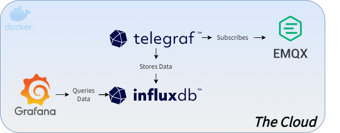

# Projeto-IoT

Repositório Projeto IoT 

## Cloud Infrastructure

The cloud infrastructure will be running on a private server. Each service will be a container and they will be interconnected by docker networks.

- **EMQX** as the main MQTT Broker

- **InfluxDB** as the main database

- **Telegraf** as the data scraper to save the JSON on the DB

- **Grafana** as the main dashboard

